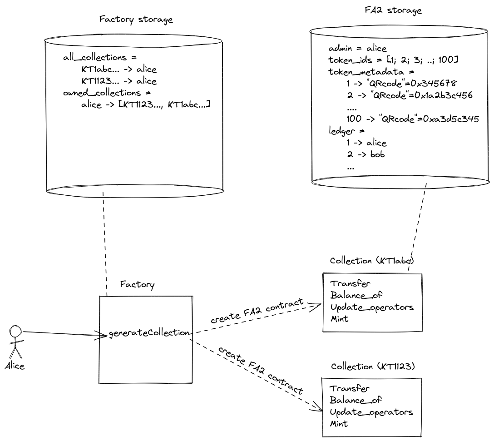

## Contract VIN (Vinus In Numeris)

This contract implements a factory of FA2 NFT. Each FA2 contract represents a collection of wine bottles. Wine bottles are represented by tokens inside a FA2 contract.
When originating a collection of bottle,

- the creator must specify a collection name and a QR code for each bottle.
- the creator owns all bottles of the collection

The creator of the collection can also add new bottles to his collection anytime (with the _Mint_ entrypoint)

A bottle owner can transfer one or more bottle to someone else (with the _Transfer_ entrypoint)

A collection of bottles is represented by a FA2 contract. The implementation of the FA2 introduces:

- a admin address on the storage which represents the creator of the FA2 contract
- a _Mint_ entrypoint that allows the creator of the FA2 to create new tokens inside the NFT contract
- a _token_usage_ map that count the number of transfer of a bottle
- a _token_usage_ view for retrieving the number of transfer of a bottle (for a given token_id)



## Pre-requisites

You need to install the following tools:

- [NodeJS & Npm](https://nodejs.org/en/download/)
- [LIGO](https://ligolang.org/docs/intro/installation/) **or** [Docker](https://docs.docker.com/get-docker/)

## How to use this template ?

### Compilation

A makefile is provided to compile the "Factory" smart contract.

```
make compile
```

You can also override `make` parameters by running :

```sh
make compile ligo_compiler=<LIGO_EXECUTABLE> protocol_opt="--protocol <PROTOCOL>"
```

### Tests

A makefile is provided to launch tests.

```
make test
```

### Deployment

A typescript script for deployment is provided to originate the smart contrat. This deployment script relies on .env file which provides the RPC node url and the deployer public and private key.
So make sure to rename `deploy/.env.dist` to `deploy/.env` and **fill the required variables**.

```
make deploy
```
